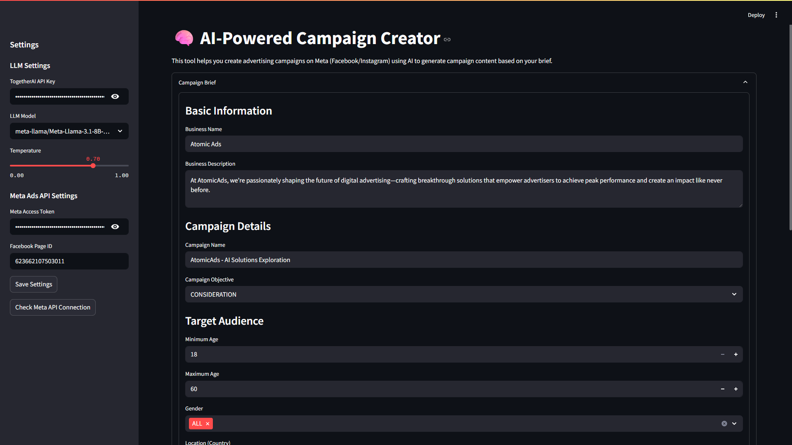
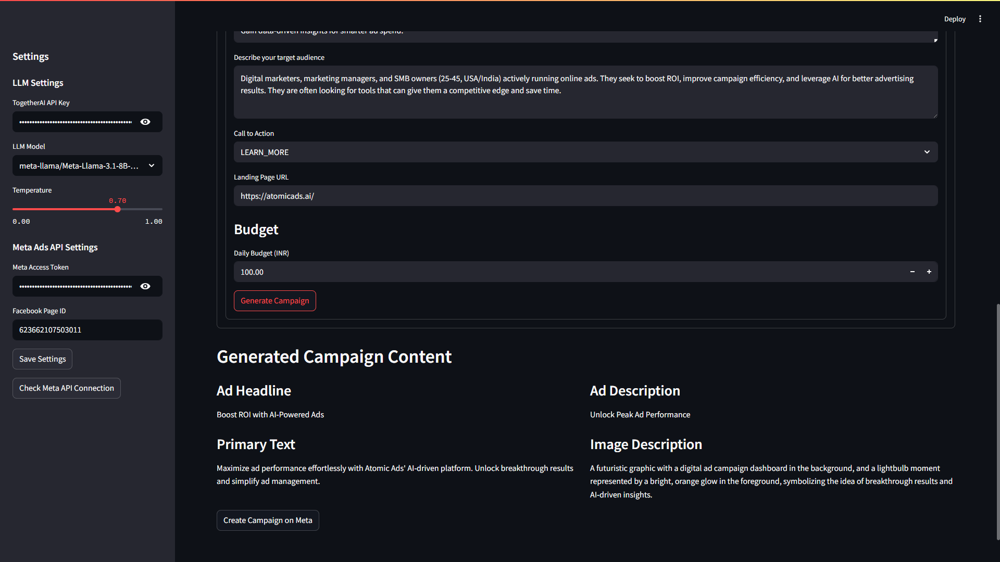

# AI-Powered Ad Campaign Creator

This tool leverages Large Language Models (LLMs) to help users generate advertising campaign content and create campaigns directly on the Meta (Facebook/Instagram) Ads platform. It features a user-friendly interface built with Streamlit.

## Architecture

The application is structured as follows:

1.  **Frontend**: A web application built using [Streamlit](https://streamlit.io/) (`main.py`). This provides the user interface for inputting campaign briefs, viewing AI-generated content, and initiating campaign creation on Meta.
2.  **LLM Integration**: Managed by `llm_handler.py`. This module:
    *   Constructs prompts based on user input.
    *   Interfaces with LLM providers (primarily Together AI) to generate ad copy (headlines, primary text, descriptions) and image descriptions.
3.  **Meta Ads API Integration**: Handled by the `ads_api/` module:
    *   `meta_ads.py`: Contains functions for interacting with the Meta Graph API to create campaigns, ad sets, and ads.
    *   `utils.py`: Provides helper functions for API error handling and data formatting.
4.  **Configuration Management**: `config.py` loads settings from a `.env` file and an optional `config.json`, managing API keys and application parameters.

## LLM Choices

*   **Primary LLM**: The application is designed to use **`meta-llama/Meta-Llama-3.1-8B-Instruct-Turbo`** hosted via **Together AI**.
    *   **Reasoning**:
        *   **Performance**: Meta-Llama provides a state-of-the-art open-source model offering strong capabilities in creative text generation, crucial for compelling ad copy.
        *   **Cost-Effectiveness**: Together AI provides efficient, pay-as-you-go access to large models, making it suitable for this project's scope.
        *   **Ease of Integration**: Together AI offers an OpenAI-compatible API, simplifying integration using the `openai` Python library.
        *   **Optimized Inference**: Leveraging Together AI's infrastructure ensures fast response times.
*   **Alternative/Fallback**: The configuration (`.env`, `config.py`) allows for specifying other models.

## Setup Instructions

**1. Prerequisites:**
*   Python 3.12
*   Git
*   [uv](https://github.com/astral-sh/uv) (optional, but recommended) or `pip`.

**2. Clone the Repository:**
```bash
git clone github.com/yash4agr/atomicads-ai-engineer-assignment-yash-agrawal.git
cd atomicads-ai-engineer-assignment-yash-agrawal
```

**3. Sync the Environment and Dependencies:**

*   **Using `uv` (recommended):**
    ```bash
    uv sync
    ```
* **Using `pip`:**
    ```bash
    python -m venv .venv
    source .venv/bin/activate  # On Windows: .venv\Scripts\activate
    pip install requirements.txt
    ```
**4. Configure Environment Variables:**
Create a `.env` file in the project's root directory by copying the structure from the example below (or use your existing `.env`):
```properties
# API Keys
TOGETHER_API_KEY="your_together_ai_api_key"
META_ACCESS_TOKEN="your_meta_access_token"
FACEBOOK_PAGE_ID="your_facebook_page_id"

# LLM Settings
DEFAULT_MODEL="meta-llama/Meta-Llama-3.1-8B-Instruct-Turbo"
DEFAULT_TEMP=0.7

# Application Settings
LOG_LEVEL=INFO
USE_TEST_MODE=false
```
*   Replace placeholder values with your actual API keys and Page ID.
    *   `TOGETHER_API_KEY`: Get this from your [Together AI account](https://api.together.ai/).
    *   `META_ACCESS_TOKEN`: A valid User Access Token for the Meta Graph API with `ads_management` and `pages_read_engagement` permissions.
    *   `FACEBOOK_PAGE_ID`: The ID of the Facebook Page you want to run ads for.

**6. Run the Streamlit Application:**
```bash
streamlit run main.py
```
The application should now be accessible in your web browser, typically at `http://localhost:8501`.

## Screenshots

**User Interface - Campaign Brief Input:**


*<center>Main form for inputting campaign details.</center>*

**User Interface - Generated Content & Meta Creation:**


*<center>Display of AI-generated ad content and option to push to Meta.</center>*


## Limitations & Considerations

*   **Content Review**: AI-generated content should **always** be reviewed by a human for accuracy, brand alignment, tone, and compliance with advertising policies before going live.
*   **API Dependencies**: The application relies on external APIs (Together AI, Meta). Outages or changes in these APIs can affect functionality.
*   **Rate Limiting**: Both LLM providers and Meta enforce API rate limits. High usage might require paid tiers or lead to temporary throttling.
*   **Meta Ad Policies**: Users are solely responsible for ensuring all campaigns comply with [Meta's Advertising Policies](https://www.facebook.com/policies/ads/).
*   **Image Generation/Handling**:
    *   The current version uses a placeholder image URL (`https://placehold.co/600x400`) for ad creatives.
    *   The image hashing logic (`image_hash`) in `ads_api/meta_ads.py` for ad creatives is a placeholder and needs to be implemented if you intend to use actual images hosted by Meta. For direct image URLs, Meta usually handles fetching, but for uploaded images, hashing is required.
*   **Targeting Specificity**: While the tool allows basic targeting, complex audience segmentation might require manual setup in Meta Ads Manager.
*   **Error Handling**: While basic error handling is in place, complex API error scenarios might require more robust recovery mechanisms.
*   **Security**: API keys are loaded from `.env`. Ensure this file is in your `.gitignore` and not committed to version control in public repositories.

## Cost Implications

*   **Together AI**: Usage of LLMs via Together AI is typically billed based on the number of input and output tokens. Refer to [Together AI's pricing page](https://www.together.ai/pricing) for current rates.
*   **Meta Ads Platform**: Running ads on Meta incurs costs based on your defined budget, bidding strategy, and ad performance. The API usage itself for campaign management is generally free.
*   **Data Transfer**: Negligible for this application's typical use.

It's crucial to monitor your spending on both platforms.